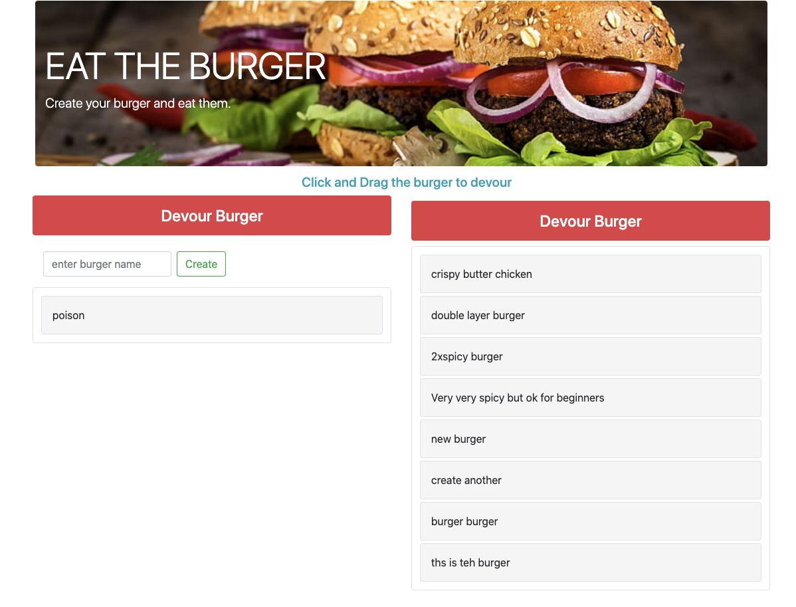

# Burger
A burger logger with MySQL, Node, Express, Handlebars and a homemade ORM (yum!). Implemented the MVC design pattern using Node and MySQL to query and route data in your app, and Handlebars to generate your HTML.

<br />

[LIVE ON HEROKU](https://calm-ridge-69484.herokuapp.com/)

<br />

### Table of Contents

- [Snapshot](#snapshot)
- [Technologies](#technologies)
- [Installation](#installation)
- [References](#references)
- [License](#license)
- [Author](#author)

---

<br />

## Snapshot


---

<br />

## Technologies

- JavaScript
- NPM Modules
- Visual Studio Code
- Node.js
- MySQL
- express
- handlebars
- bootstrap v4.3
- jQuery
- jQuery-ui

---

<br />

## Installation

The steps listed below will guide you through the installation proces.
  
- Node.js

  To Install node.js [click here](https://nodejs.org/en/download/)

- Clone the repository. 
    ```bash
    $ git clone https://github.com/amitkarmacharya-edu/burger.git
    ```


- Inside the root folder execute the following command

    ```bash
    $ npm install
    ```


- to run the app execute the following command

    ```bash
    $ node server.js
    ```

- Enter http://localhost:8000/ in the browser

---

<br />

## References

- w3school -- [Node.js NPM](https://www.w3schools.com/nodejs/nodejs_npm.asp)
- [NPM](https://www.npmjs.com/)
- [About Node.js](https://nodejs.org/en/)
- [The package.json guide](https://nodejs.dev/learn/the-package-json-guide)
- [Mysql module](https://www.npmjs.com/package/mysql)
- [HandleBar.js](https://handlebarsjs.com/)
- [Express](https://expressjs.com/en/starter/installing.html)

---
<br />

## License


---

<br />

## Author

- Linkedin -- [Amit Karmacharya](https://www.linkedin.com/in/amit-karmacharya-b344731ab/)
